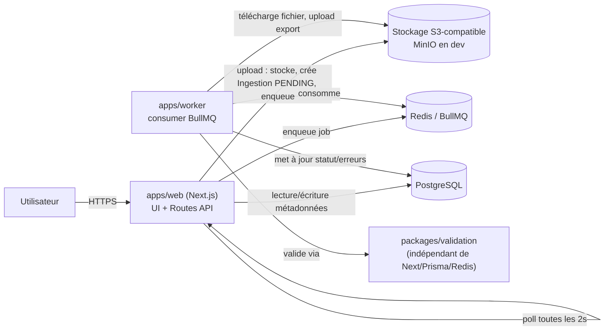
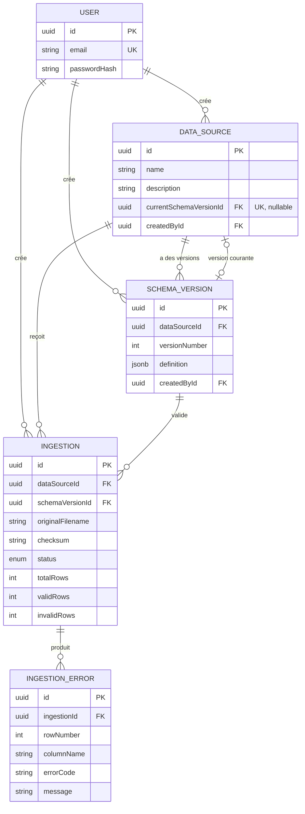

# DESIGN.md — DataFlow CI · Plateforme d'ingestion & validation de fichiers

> **Statut de ce document** : finalisé. Rédigé au fil de l'eau pendant l'implémentation (voir
> CLAUDE.md, règle « documente au fil de l'eau ») plutôt que reconstruit a posteriori — chaque
> section reflète l'état réel du code au moment où elle a été écrite, vérifié par
> typecheck/lint/test avant d'être documenté comme acquis.

---

## 1. Compréhension du besoin

DataFlow CI agrège et revend de la donnée à des clients télécom, banque et grande distribution. Ces
clients envoient chaque jour des fichiers CSV/Excel, chacun avec son propre format et ses propres
règles métier. Aujourd'hui, 4 personnes ouvrent ces fichiers à la main, vérifient leur conformité et
les chargent dans le data warehouse. Le processus est lent, coûteux, et ne laisse aucune trace
exploitable en cas d'erreur.

Le MVP doit remplacer ce contrôle manuel par une plateforme self-service : déclaration de sources
avec un schéma attendu (versionnable), upload de fichiers, validation ligne par ligne asynchrone,
rapport d'ingestion détaillé, export des lignes valides, et un dashboard de suivi.

**Hypothèses fonctionnelles** : voir [ASSUMPTIONS.md](ASSUMPTIONS.md) pour le détail (qui sont les
utilisateurs, périmètre Excel, gestion des colonnes en trop/manquantes, détection de doublons,
définition précise des 5 statuts).

---

## 2. Architecture



Flux d'upload : `web` valide et stocke le fichier → crée un enregistrement d'ingestion `PENDING` →
enqueue un job → répond immédiatement (jamais bloqué par le traitement). `worker` traite le job en
arrière-plan (téléchargement, validation via `packages/validation`, upload de l'export, écriture des
erreurs, statut final) et met à jour la base au fil de l'eau. L'UI poll `GET /api/ingestions/:id`
toutes les 2 secondes jusqu'à un statut terminal (voir ADR-009).

Résumé de l'architecture retenue (voir [DECISIONS.md](DECISIONS.md) pour la justification complète
de chaque choix) :

- **Monorepo** pnpm workspaces + Turborepo — `apps/web` (Next.js App Router, UI + API), `apps/worker`
  (process Node/TS indépendant), `packages/*` (domain, database, validation, queue, storage, config).
- **PostgreSQL + Prisma** pour les métadonnées (sources, schémas, fichiers ingérés, erreurs).
- **Redis + BullMQ** pour la file de traitement asynchrone, consommée par `apps/worker`.
- **MinIO (S3-compatible)** pour le stockage des fichiers bruts et des exports CSV.
- **Auth.js** (Credentials, JWT) pour l'authentification.

---

## 3. Modélisation du domaine

### 3.1 Entités

Cinq entités (voir `packages/database/prisma/schema.prisma`) :

- **User** — un compte (email, mot de passe hashé).
- **DataSource** — une source de données déclarée (ex. "Ventes Orange CI - Hebdo"), avec un
  pointeur `currentSchemaVersionId` vers la version de schéma actuellement active.
- **SchemaVersion** — une version immuable du schéma attendu d'une source (`definition` en JSONB,
  voir §3.3). Un `versionNumber` auto-incrémenté, unique par source.
- **Ingestion** — un fichier uploadé et son traitement : statut, compteurs de lignes, clés de
  stockage du fichier original et de l'export des lignes valides, checksum.
- **IngestionError** — une erreur de validation sur une ligne précise d'une `Ingestion`.

### 3.2 Diagramme ER



La relation `DATA_SOURCE ||--o{ SCHEMA_VERSION` (historique complet) et
`DATA_SOURCE |o--o| SCHEMA_VERSION` (version courante) sont **deux relations Prisma distinctes**
entre les deux mêmes modèles : l'une portée par `SchemaVersion.dataSourceId` (obligatoire — une
version appartient toujours à une source), l'autre par `DataSource.currentSchemaVersionId`
(optionnelle — une source peut exister avant sa première version). Voir ADR-014 dans
[DECISIONS.md](DECISIONS.md).

### 3.3 Format JSON du schéma (`SchemaVersion.definition`)

Postgres stocke `definition` en `jsonb` sans contrainte de forme — le contrat réel est un schéma
Zod dans `packages/domain` (`schemaDefinitionSchema`), qui valide toute écriture avant qu'elle
n'atteigne la base. Exemple (source "Ventes Orange CI") :

```json
{
  "columns": [
    { "name": "date", "type": "date", "required": true, "dateFormat": "YYYY-MM-DD" },
    {
      "name": "region",
      "type": "string",
      "required": true,
      "allowedValues": ["Abidjan", "Bouaké", "Daloa"]
    },
    { "name": "montant_fcfa", "type": "integer", "required": true, "positive": true },
    { "name": "client_id", "type": "string", "required": true, "pattern": "^CLI-\\d{6}$" }
  ],
  "allowExtraColumns": false,
  "trimStrings": true,
  "caseSensitiveHeaders": false,
  "duplicateKeyColumns": ["client_id", "date"]
}
```

Six types de colonne (`string`, `integer`, `number`, `boolean`, `date`, `datetime`), modélisés en
**union discriminée** sur `type` : chaque type n'expose que les contraintes qui ont un sens pour
lui (ex. `pattern`/`minLength`/`maxLength` sur `string` uniquement ; `min`/`max`/`positive` sur
`integer`/`number`/`date`/`datetime` ; `dateFormat` obligatoire sur `date`/`datetime`). `unique`
(colonne seule) et `duplicateKeyColumns` (clé composite au niveau du schéma, ex. `client_id` +
`date` ensemble) couvrent deux besoins différents de détection de doublons.

La validation de la définition elle-même (pas des données d'un fichier) vérifie en plus, par
raffinement Zod : noms de colonnes uniques, `min ≤ max`, `minLength ≤ maxLength`, `pattern` est une
regex syntaxiquement valide, et `duplicateKeyColumns` ne référence que des colonnes déclarées.
22 tests unitaires couvrent les cas valides et invalides (`packages/domain/src/
schemaDefinition.test.ts`).

### 3.4 Invariants principaux

- Une `SchemaVersion` est **immuable** : `packages/database` n'expose aucune fonction de mise à
  jour d'une version existante (voir `schemaVersionRepository.ts`).
- Le numéro de version est unique au sein d'une source (`@@unique([dataSourceId, versionNumber])`).
- Créer une nouvelle version la promeut **automatiquement** en version courante de la source (même
  transaction : insertion de la version + mise à jour de `DataSource.currentSchemaVersionId`).
- Une `Ingestion` référence toujours la version de schéma **exacte** utilisée pour la valider —
  cette référence ne change jamais rétroactivement, même si la source change de version courante
  ensuite.
- Une `IngestionError` appartient à exactement une `Ingestion`.
- **Suppressions** : toutes les relations sont en `onDelete: Restrict` (on ne peut pas supprimer un
  `User`/`DataSource`/`SchemaVersion` tant qu'il porte de l'historique), sauf
  `IngestionError → Ingestion` en `Cascade` (une erreur n'a pas de sens sans son ingestion). Voir
  ADR-015 dans [DECISIONS.md](DECISIONS.md).

### 3.5 Index

- `DataSource(createdById)` — lister les sources créées par un utilisateur.
- `SchemaVersion(dataSourceId, versionNumber)` (unique) — sert aussi d'index pour "toutes les
  versions d'une source" (règle du préfixe gauche : pas d'index séparé sur `dataSourceId` seul).
- `Ingestion(dataSourceId, createdAt)` — historique d'une source, trié par date (page liste).
- `Ingestion(schemaVersionId)` — retrouver les ingestions ayant utilisé une version donnée.
- `Ingestion(status)` — requêtes de monitoring ("tous les fichiers en erreur").
- `Ingestion(dataSourceId, checksum)` — détecter le ré-upload exact du même fichier sur une source.
- `IngestionError(ingestionId, rowNumber)` — le seul pattern de lecture des erreurs (toutes les
  erreurs d'une ingestion, triées par ligne) ; sert aussi de préfixe pour "toutes les erreurs d'une
  ingestion" sans tri, pas besoin d'un index séparé sur `ingestionId` seul.

### 3.6 Moteur de validation (`packages/validation`)

Package indépendant de Next.js, Prisma, Redis et BullMQ (seule dépendance interne :
`@dataflow-ci/domain`, pour le type `SchemaDefinition`) — testable et exécutable seul, appelé par
`apps/worker`. Point d'entrée unique : `validateFile({ fileFormat, fileStream, schema })`.

**Étapes du traitement d'un fichier** :

1. Lecture du flux d'entrée (CSV en streaming via `csv-parse`, XLSX chargé entièrement via
   `exceljs` — voir ADR-024) ; un fichier illisible ou vide produit une erreur `MALFORMED_FILE`
   immédiate (`rowNumber: 0`), sans tenter d'aller plus loin.
2. Normalisation des en-têtes (trim, et casse selon `caseSensitiveHeaders`).
3. Détection des en-têtes en double (`DUPLICATE_HEADER`).
4. Vérification des colonnes obligatoires manquantes (`MISSING_REQUIRED_COLUMN`).
5. Vérification des colonnes non déclarées, sauf si `allowExtraColumns` (`EXTRA_COLUMN`) — colonnes
   en trop tolérées, elles, sont simplement ignorées (jamais exportées).
6. Si une erreur de structure (étapes 2-5) est détectée, le fichier n'est pas parcouru ligne par
   ligne — inutile, la correspondance colonne↔schéma n'est pas fiable.
7. Pour chaque ligne de données : normalisation des cellules (trim selon `trimStrings`).
8. Vérification du caractère obligatoire de chaque cellule (`REQUIRED_VALUE`).
9. Conversion de type (`INVALID_INTEGER`, `INVALID_NUMBER`, `INVALID_BOOLEAN`, `INVALID_DATE`,
   `INVALID_DATETIME`).
10. Application des contraintes (`VALUE_NOT_ALLOWED`, `REGEX_MISMATCH`, `MIN_VALUE`, `MAX_VALUE`,
    `MIN_LENGTH`, `MAX_LENGTH`, `NOT_POSITIVE`) — une cellule s'arrête à la première violation
    rencontrée (ADR-025), jamais plus d'une erreur par cellule.
11. Détection de doublons de ligne sur `duplicateKeyColumns` (`DUPLICATE_ROW`) — seules les
    occurrences suivant la première sont marquées en erreur (voir ASSUMPTIONS.md §4).
12. Une ligne sans aucune erreur est comptée valide et ajoutée à l'export CSV ; une ligne avec au
    moins une erreur ne l'est pas (mais toutes ses erreurs sont conservées, pas seulement la
    première trouvée sur la ligne).
13. Export des lignes valides en CSV, avec neutralisation de l'injection de formule (`=`, `+`, `-`,
    `@` en tête de cellule préfixés d'une apostrophe — ADR-026, OWASP "CSV Injection").

**Taxonomie d'erreurs** (19 codes, `packages/validation/src/errorCodes.ts`) : chaque erreur porte
`rowNumber` (0 = erreur de structure, ≥1 = ligne de données), `columnName`, `errorCode`, `message`
et `rawValue`. Codes de structure : `MISSING_REQUIRED_COLUMN`, `EXTRA_COLUMN`, `DUPLICATE_HEADER`,
`MALFORMED_FILE`. Codes de cellule : `REQUIRED_VALUE`, `INVALID_STRING`, `INVALID_INTEGER`,
`INVALID_NUMBER`, `INVALID_BOOLEAN`, `INVALID_DATE`, `INVALID_DATETIME`, `VALUE_NOT_ALLOWED`,
`REGEX_MISMATCH`, `MIN_VALUE`, `MAX_VALUE`, `MIN_LENGTH`, `MAX_LENGTH`, `NOT_POSITIVE`. Code de
ligne : `DUPLICATE_ROW`.

**Fixtures de test** (`packages/validation/fixtures/`) : `clean.csv` (entièrement valide),
`partially-invalid.csv` (mélange), `fully-invalid.csv` (aucune ligne valide), `empty.csv` (aucune
ligne de données), `duplicates.csv` (doublons sur colonnes clé), `extra-columns.csv` (colonne non
déclarée), `corrupted.xlsx` (fichier non-ZIP avec extension `.xlsx`) — couvrent chacune un scénario
distinct exercé par `validateFile.test.ts` (68 tests au total dans le package, tous passants).

### 3.7 Dashboard de monitoring

Page `/dashboard`, fenêtre par défaut 30 jours glissants (ASSUMPTIONS.md §7), sélecteur 7/30/90
jours (`?days=`). Cinq KPI en tête (fichiers ingérés, taux de succès, en cours, lignes traitées,
sources actives), puis trois visualisations Recharts, chacune répondant à une question différente :

1. **Ingestions par jour, barres empilées par statut** — répond à "le volume traité augmente ou
   diminue dans le temps, et la proportion d'échecs évolue-t-elle ?". Une série continue (un point
   par jour, y compris les jours sans activité, comptés à zéro par `buildDailyStatusSeries`) plutôt
   qu'une liste éparse, pour un axe des temps lisible sans trous.
2. **Répartition par statut, donut** — répond à "sur la période, quelle proportion des fichiers a
   réellement posé problème ?". Une vue proportionnelle instantanée, complémentaire du graphique 1
   (qui montre l'évolution, pas la part globale).
3. **Sources les plus actives, barres horizontales** — répond à "d'où vient le volume, et quelles
   sources méritent une attention si leur taux d'échec est élevé ?". Triée par nombre d'ingestions
   descendant, limitée aux 5 premières (`getTopSourcesByVolume`) pour rester lisible même avec
   beaucoup de sources.

Chaque graphique gère explicitement l'absence de donnée (message plutôt qu'un graphique vide ou une
erreur de rendu) — voir ADR-030 pour le choix de faire porter les agrégations par le Server
Component plutôt que par une route API dédiée.

---

## 4. Choix techniques

Voir [DECISIONS.md](DECISIONS.md) pour le détail au format ADR (contexte, alternatives considérées,
conséquences) de chaque choix structurant : monorepo, Next.js App Router, worker + BullMQ/Redis,
PostgreSQL + Prisma, modélisation normalisée du schéma de colonnes, Zod pour la validation dynamique,
MinIO pour le stockage, Auth.js Credentials, polling plutôt que SSE/WebSocket, versionnement de
schéma figé à l'upload, détection de doublons intra-fichier, packages partagés sans build séparé,
dépendances du moteur de validation (`csv-parse`/`csv-stringify`/`exceljs`), XLSX chargé en mémoire
vs CSV en streaming, une seule erreur par cellule, neutralisation de l'injection CSV à l'export,
statut final dérivé côté worker (pas dans le moteur de validation), téléchargement de l'export via
redirection vers une URL signée (jamais proxié par Next.js), dashboard sans route API dédiée
(agrégations directement par le Server Component, période pilotée par un paramètre d'URL).

---

## 5. Ce qui marche, ce qui ne marche pas, ce qui manque

**Ce qui marche** (implémenté, testé — 192 tests unitaires/intégration mockée, tous passants sur
tout le monorepo à la fin du challenge) : authentification (Credentials, middleware + vérification
serveur) ; sources et versions de schéma (création, JSON validé par Zod, immuabilité) ; upload
(validation taille/extension/magic-bytes, checksum, déduplication) ; queue BullMQ (retries, backoff,
verrou logique anti race condition, graceful shutdown, healthcheck) ; moteur de validation CSV/XLSX
complet (19 codes d'erreur, doublons, export sécurisé) ; worker câblé au moteur réel ; rapport
d'ingestion (polling, erreurs paginées, export via URL signée) ; dashboard (3 visualisations
Recharts, sélecteur de période) ; Dockerfiles et CI GitHub Actions écrits.

**Ce qui ne marche pas / n'a pas pu être vérifié** : toute la chaîne qui dépend d'une vraie
infrastructure (Postgres/Redis/MinIO/Docker) n'a **jamais tourné en direct** sur la machine de
développement — Docker Desktop/WSL2 y est resté indisponible pendant tout le challenge (voir
TASKS.md T02). Concrètement : aucune migration Prisma réelle, aucun seed réel, aucun test e2e
Playwright exécuté (écrit et prêt, voir `apps/web/e2e/`), aucune image Docker construite, aucun
déploiement réalisé. Tout ce périmètre a été vérifié aussi loin que possible sans infrastructure
(`prisma validate`/`prisma generate`, typecheck, tests unitaires avec repositories/storage/queue
mockés) mais reste **non vérifié en conditions réelles**.

**Ce qui manque** : détection dédiée des fichiers à encodage invalide (un tel fichier produit
aujourd'hui des erreurs de validation normales plutôt qu'un diagnostic explicite — voir TASKS.md
T37) ; formulaire structuré pour l'édition de schéma (JSON brut pour le MVP, voir ADR-016) ;
détection de doublons contre l'historique déjà ingéré (intra-fichier seulement, voir ADR-011) ;
gestion de rôles/multi-tenant (single-tenant assumé, voir ASSUMPTIONS.md §1) ; suppression réelle
(soft-delete) des entités avec historique.

---

## 6. Trade-offs assumés

- **Polling plutôt que SSE/WebSocket** pour le suivi de statut — simplicité et fiabilité derrière
  n'importe quel hébergeur, au prix d'un délai de rafraîchissement de 2 secondes (ADR-009).
- **Détection de doublons intra-fichier uniquement**, pas contre l'historique déjà ingéré — évite
  une question de fenêtre/performance hors périmètre MVP (ADR-011).
- **Packages partagés consommés en source TypeScript** sans étape de build séparée — plus simple à
  faire tourner en monorepo, au prix d'un `tsc --noEmit` plutôt qu'une vraie émission (ADR-012).
- **`definition` en JSONB validé par Zod** plutôt qu'un schéma de colonnes normalisé — Postgres ne
  peut pas garantir seul la forme du contenu, seule la couche applicative le fait (ADR-013).
- **XLSX chargé entièrement en mémoire**, CSV en vrai streaming — écart assumé compte tenu du
  plafond de 10 Mo par fichier (ADR-024).
- **Une seule erreur par cellule** (arrêt à la première règle violée) — rapport plus lisible, au
  prix d'un nombre d'erreurs légèrement sous-estimé sur une cellule qui cumule plusieurs problèmes
  (ADR-025).
- **Statut final dérivé côté worker**, jamais dans `packages/validation` — garde le moteur de
  validation indépendant du vocabulaire `Ingestion` (ADR-027).
- **Dashboard sans route API dédiée** — agrégations calculées directement par le Server Component,
  au prix de perdre la possibilité de rafraîchissement automatique (pas un besoin du dashboard,
  contrairement au rapport d'ingestion — ADR-030).
- **Images Docker sans `output: "standalone"`** — plus lourdes qu'elles ne pourraient l'être, pour
  rester constructibles/vérifiables aussi bien en local (Windows, cette machine) que dans le
  conteneur Linux cible (ADR-031).

---

## 7. Next steps (si 2 semaines de plus)

1. **Vérifier tout ce qui n'a pas pu l'être** : migrations/seed réels, tests e2e Playwright, build
   et exécution des images Docker, un vrai déploiement — priorité absolue avant toute nouvelle
   fonctionnalité, puisque c'est la plus grosse zone d'incertitude du livrable actuel.
   `output: "standalone"` (ADR-031) serait le premier point à revalider dans un environnement Linux.
2. **Formulaire structuré d'édition de schéma** (au lieu du JSON brut, ADR-016) — le chantier UI le
   plus significatif reporté du MVP.
3. **Détection de doublons contre l'historique** déjà ingéré d'une source, pas seulement
   intra-fichier (ADR-011) — nécessite une stratégie de fenêtre/performance à concevoir.
4. **SSE ou WebSocket** en remplacement du polling pour le rapport d'ingestion (ADR-009), une fois
   la fiabilité de l'infrastructure de production éprouvée.
5. **Multi-tenant** : isolation des sources par client (ASSUMPTIONS.md §1) si DataFlow CI veut
   exposer la plateforme directement à ses clients plutôt qu'à ses seuls opérateurs internes.
6. **Détection dédiée de l'encodage invalide** (T37) avec un code d'erreur explicite plutôt qu'un
   résultat de validation générique.
7. **CD** : pipeline de déploiement continu sur push `main`, une fois un environnement de production
   réel en place (T47, dépend de T45).

---

## Annexes

- Plan d'analyse détaillé (cas d'usage, risques, modèle de données complet, arborescence, planning
  14 jours, questions au tuteur) : conservé dans l'historique de conception du projet, repris section
  par section dans ce document au fur et à mesure de l'implémentation.
- [TASKS.md](TASKS.md) — backlog détaillé par épique.
- [ASSUMPTIONS.md](ASSUMPTIONS.md) — hypothèses fonctionnelles.
- [DECISIONS.md](DECISIONS.md) — décisions techniques (ADR).
