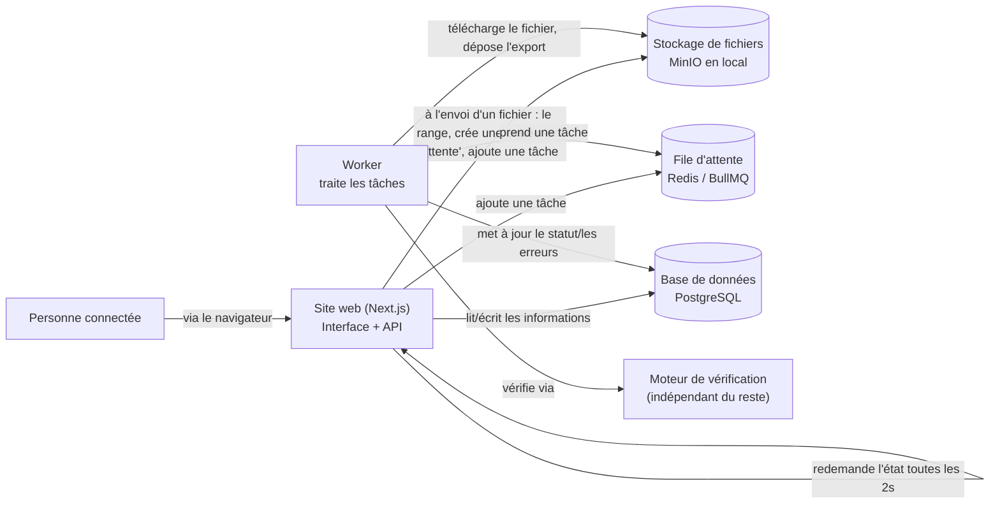
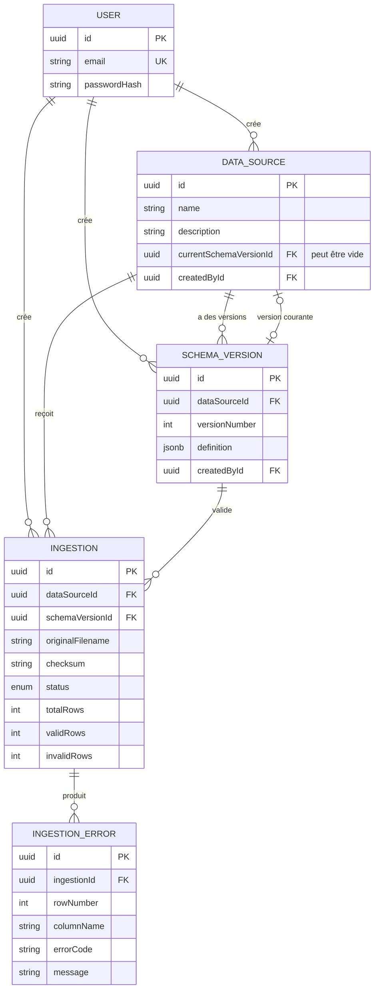

# DESIGN.md — DataFlow CI · Comment le projet est construit

> **À propos de ce document** : il a été écrit au fur et à mesure du développement, pas reconstitué
> après coup — chaque section correspond à l'état réel du code au moment où elle a été rédigée. Il
> est volontairement écrit en mots simples, avec les termes techniques expliqués au fil du texte,
> pour rester compréhensible même sans expérience en programmation.

---

## Petit lexique — les mots techniques utilisés dans ce document

- **Monorepo** : un seul dépôt de code qui regroupe plusieurs projets liés (ici : le site web et le
  programme de traitement en arrière-plan), au lieu d'avoir un dépôt séparé pour chacun.
- **Worker** : un programme qui tourne en arrière-plan, séparé du site web, et qui fait le travail
  long (lire et vérifier un fichier). Pendant qu'il travaille, le site reste réactif pour tout le
  monde.
- **File d'attente (Redis / BullMQ)** : une liste de tâches à faire, dans l'ordre — dès qu'un fichier
  est envoyé, une tâche est ajoutée à la liste, et le worker la traite dès qu'il est libre.
- **Base de données relationnelle (PostgreSQL)** : l'endroit où sont conservées les informations
  structurées du projet (sources, schémas, résultats), organisées en tables reliées entre elles.
- **ORM (Prisma)** : un outil qui permet d'écrire des requêtes vers la base de données directement en
  code, sans écrire de langage de requête (SQL) à la main pour chaque cas.
- **Stockage de fichiers (S3 / MinIO)** : l'endroit où sont conservés les fichiers eux-mêmes (le
  CSV/Excel envoyé) — différent de la base de données, qui ne garde que des informations, pas les
  gros fichiers.
- **API** : la partie du programme qui répond aux demandes envoyées depuis le navigateur.
- **Server Component / Client Component** : dans ce projet (construit avec Next.js), une page peut
  être composée de deux types de morceaux : ceux qui s'exécutent sur le serveur avant l'envoi de la
  page (accès direct à la base de données, jamais visible depuis le navigateur), et ceux qui
  s'exécutent dans le navigateur de la personne (interactions, clics, formulaires).
- **JSONB** : un format flexible qui permet de stocker une petite structure de données (une liste de
  règles, par exemple) directement dans une case de la base de données, sans avoir à créer une table
  séparée pour chaque champ possible.
- **Zod** : un outil qui vérifie, au moment de l'exécution, qu'une donnée a bien la forme attendue
  avant de l'utiliser — par exemple "ce champ doit être un nombre positif", vérifié réellement au
  lieu d'être juste une intention écrite en commentaire.
- **Index (base de données)** : un raccourci que la base de données garde en mémoire pour retrouver
  des lignes rapidement selon un critère précis, plutôt que de devoir parcourir toute une table à
  chaque recherche.
- **Streaming** : lire un fichier morceau par morceau au fur et à mesure, plutôt que de devoir
  charger le fichier entier en mémoire avant de commencer à le traiter.
- **Checksum** : une empreinte unique calculée à partir du contenu exact d'un fichier — deux fichiers
  identiques ont toujours le même checksum, ce qui permet de détecter un renvoi accidentel du même
  fichier.
- **Fiche ADR** (*Architecture Decision Record*) : une fiche qui explique une décision technique —
  le contexte, ce qui a été choisi, les autres options envisagées, et ce que cette décision entraîne
  comme conséquences. Le détail complet de chaque décision de ce projet est dans
  [DECISIONS.md](DECISIONS.md).
- **MVP** (*Minimum Viable Product*, "produit minimum viable") : la version la plus simple d'un
  produit qui reste réellement utile et utilisable, sans toutes les fonctionnalités possibles.

---

## 1. Le besoin à résoudre

DataFlow CI collecte et revend des données pour des clients télécom, des banques et des enseignes de
grande distribution. Ces clients envoient chaque jour des fichiers CSV/Excel, chacun avec son propre
format et ses propres règles. Aujourd'hui, 4 personnes ouvrent ces fichiers à la main, vérifient
qu'ils sont corrects et les chargent ensuite dans l'entrepôt de données de l'entreprise. Ce contrôle
manuel est lent, coûteux, et ne laisse aucune trace exploitable quand une erreur passe au travers.

Ce projet remplace ce contrôle manuel par une plateforme où l'on peut : déclarer une source avec un
schéma attendu (avec un historique de versions), envoyer des fichiers, les faire vérifier ligne par
ligne en arrière-plan, consulter un rapport détaillé, exporter les lignes correctes, et suivre
l'activité sur un tableau de bord.

**Les questions laissées ouvertes par le brief** (qui sont les utilisateurs, quels formats Excel,
comment gérer les colonnes en trop, comment détecter les doublons, ce que veut dire exactement
chacun des 5 statuts) sont traitées en détail dans [ASSUMPTIONS.md](ASSUMPTIONS.md).

---

## 2. Comment les différentes parties du projet communiquent entre elles



Ce que ce schéma montre : quand une personne envoie un fichier, le site web (`web`) le range dans le
stockage de fichiers, crée une entrée "en attente" dans la base de données, ajoute une tâche dans la
file d'attente, puis répond tout de suite — sans attendre que le fichier soit vérifié. Le worker,
séparément, récupère cette tâche dès qu'il est libre, télécharge le fichier, le vérifie ligne par
ligne à l'aide du moteur de vérification, dépose l'export des lignes correctes, écrit les erreurs
trouvées, et met à jour le statut final. Pendant ce temps, l'écran du navigateur redemande l'état du
fichier toutes les 2 secondes (une technique appelée **polling**) jusqu'à ce que le traitement soit
terminé — plus simple et plus fiable qu'une connexion permanente entre le navigateur et le serveur,
au prix d'un léger délai d'affichage (voir la fiche ADR-009 dans [DECISIONS.md](DECISIONS.md)).

Résumé des choix retenus (raison complète de chacun dans [DECISIONS.md](DECISIONS.md)) :

- **Monorepo** avec deux programmes séparés : `apps/web` (le site, avec son interface et son API) et
  `apps/worker` (le programme de traitement en arrière-plan), plus des morceaux de code partagés
  entre les deux (`packages/*`).
- **PostgreSQL + Prisma** pour toutes les informations structurées (sources, schémas, fichiers
  envoyés, erreurs trouvées).
- **Redis + BullMQ** pour la file d'attente des tâches de vérification, traitée par le worker.
- **MinIO** (compatible avec le standard S3) pour conserver les fichiers bruts envoyés et les
  exports.
- **Auth.js** pour gérer les connexions par identifiant/mot de passe.

---

## 3. Comment les informations sont organisées

### 3.1 Les 5 types d'informations principales (les "entités")

Le projet distingue 5 types d'informations, chacun rangé dans sa propre table de la base de données
(détail exact dans `packages/database/prisma/schema.prisma`) :

- **User** — un compte utilisateur (adresse email, mot de passe protégé — jamais stocké en clair).
- **DataSource** — une source de données déclarée (par exemple "Ventes Orange CI - Hebdo"), avec un
  pointeur vers la version de schéma actuellement utilisée pour vérifier ses fichiers.
- **SchemaVersion** — une version figée du schéma attendu pour une source (la liste des colonnes et
  leurs règles). Chaque nouvelle version reçoit un numéro qui s'incrémente, propre à sa source.
- **Ingestion** — un fichier envoyé et son traitement : statut, nombre de lignes correctes/en
  erreur, emplacement du fichier original et de l'export des lignes correctes, empreinte du contenu
  (checksum).
- **IngestionError** — une erreur trouvée sur une ligne précise d'un fichier envoyé.

### 3.2 Comment ces informations sont reliées entre elles



Ce schéma (dit "entité-relation") montre comment chaque type d'information est relié aux autres. Un
détail technique à noter : une source est reliée à ses schémas de **deux façons différentes** — une
fois pour dire "voici tout l'historique des versions de cette source" (une source peut en avoir
plusieurs), et une fois pour dire "voici la version actuellement utilisée pour vérifier les nouveaux
fichiers" (une source peut ne pas encore en avoir choisi une). Ces deux liens sont enregistrés
séparément dans la base de données — voir la fiche ADR-014 dans [DECISIONS.md](DECISIONS.md) pour le
détail.

### 3.3 Le format d'un schéma (ce qui définit les règles attendues d'une source)

Techniquement, le champ `definition` d'une `SchemaVersion` est stocké en JSONB — un format flexible,
sans structure figée imposée par la base de données elle-même. C'est le code de l'application (via
Zod, dans `packages/domain`) qui garantit que ce qui est écrit respecte bien la forme attendue, à
chaque fois, avant que ce ne soit enregistré. Exemple concret, pour une source "Ventes Orange CI" :

```json
{
  "columns": [
    { "name": "date", "type": "date", "required": true, "dateFormat": "YYYY-MM-DD" },
    {
      "name": "region",
      "type": "string",
      "required": true,
      "allowedValues": ["Abidjan", "Bouaké", "Daloa"]
    },
    { "name": "montant_fcfa", "type": "integer", "required": true, "positive": true },
    { "name": "client_id", "type": "string", "required": true, "pattern": "^CLI-\\d{6}$" }
  ],
  "allowExtraColumns": false,
  "trimStrings": true,
  "caseSensitiveHeaders": false,
  "duplicateKeyColumns": ["client_id", "date"]
}
```

Six types de colonnes sont possibles (texte, entier, nombre décimal, vrai/faux, date, date+heure).
Chaque type n'accepte que les règles qui ont du sens pour lui — par exemple, un motif de texte
(`pattern`) ou une longueur minimale/maximale n'a de sens que pour du texte ; un minimum/maximum n'a
de sens que pour un nombre ou une date. Le code garantit cette cohérence automatiquement (une
technique appelée **union discriminée** : "selon la valeur du champ `type`, les autres champs
autorisés changent").

La vérification du schéma lui-même (pas encore des données d'un fichier, juste de la définition des
règles) contrôle en plus : que les noms de colonnes ne se répètent pas, que le minimum est bien
inférieur ou égal au maximum, que le motif de texte donné est valide, et que les colonnes citées
comme "clé pour détecter les doublons" existent bien parmi les colonnes déclarées. 22 tests
automatiques couvrent les cas valides et invalides de cette vérification.

### 3.4 Règles qui ne changent jamais (les "invariants")

- Une **SchemaVersion**, une fois créée, ne peut plus être modifiée — pour changer les règles, on en
  crée une nouvelle version, l'ancienne reste consultable telle quelle dans l'historique.
- Le numéro de version est unique pour une même source (deux sources différentes peuvent chacune
  avoir leur "version 1").
- Créer une nouvelle version la fait automatiquement devenir la version active de sa source.
- Un fichier envoyé (`Ingestion`) garde toujours la référence exacte de la version de schéma qui a
  servi à le vérifier — même si la source change de version active plus tard, cette référence ne
  bouge jamais rétroactivement.
- Une erreur (`IngestionError`) appartient toujours à un seul fichier envoyé.
- **Suppressions** : par défaut, rien ne peut être supprimé tant qu'il porte de l'historique (par
  exemple, on ne peut pas supprimer un compte qui a créé des sources) — seule une erreur de
  vérification peut être supprimée seule, puisqu'elle n'a aucun sens sans le fichier auquel elle se
  rapporte. Voir la fiche ADR-015 dans [DECISIONS.md](DECISIONS.md).

### 3.5 Les raccourcis de recherche (index) mis en place

Un index de base de données est comme la table des matières d'un livre : il permet de retrouver des
lignes rapidement selon un critère précis, sans avoir à relire toute la table à chaque fois. Ceux mis
en place dans ce projet, et la recherche que chacun accélère :

- Retrouver toutes les sources créées par un utilisateur.
- Retrouver toutes les versions d'une source (sert aussi à garantir l'unicité du numéro de version).
- Retrouver l'historique des fichiers d'une source, du plus récent au plus ancien.
- Retrouver tous les fichiers qui ont utilisé une version de schéma donnée.
- Retrouver tous les fichiers dans un statut donné (utile pour surveiller "tous les fichiers en
  échec").
- Détecter si exactement le même fichier a déjà été envoyé sur la même source (comparaison
  d'empreintes).
- Retrouver toutes les erreurs d'un fichier, triées par numéro de ligne — la seule façon dont les
  erreurs sont jamais consultées dans ce projet.

### 3.6 Le moteur de vérification (`packages/validation`)

Ce module ne dépend d'aucune autre brique du projet (ni du site, ni de la base de données, ni de la
file d'attente) — il peut être testé et exécuté tout seul. Le worker l'appelle avec trois
informations : le format du fichier, son contenu, et le schéma à respecter.

**Les grandes étapes de la vérification d'un fichier** :

1. Lecture du fichier — un CSV est lu morceau par morceau (streaming), un Excel est chargé
   entièrement d'un coup (plus simple, acceptable vu la taille limitée des fichiers acceptés). Un
   fichier illisible ou vide déclenche tout de suite une erreur claire, sans aller plus loin.
2. Nettoyage des titres de colonnes (espaces en trop retirés, gestion des majuscules/minuscules
   selon le réglage choisi pour la source).
3. Détection de titres de colonnes en double dans l'en-tête du fichier.
4. Vérification qu'aucune colonne obligatoire du schéma ne manque dans le fichier.
5. Vérification des colonnes présentes dans le fichier mais non prévues par le schéma — sauf si la
   source autorise explicitement les colonnes en trop, auquel cas elles sont simplement ignorées.
6. Si une des quatre étapes précédentes détecte un problème de structure, le fichier n'est **pas**
   vérifié ligne par ligne — cela n'aurait pas de sens, la correspondance entre les colonnes du
   fichier et celles attendues n'est pas fiable.
7. Pour chaque ligne de données : nettoyage des espaces en trop dans chaque case (si activé).
8. Vérification qu'aucune case obligatoire n'est vide.
9. Vérification que chaque valeur peut bien être comprise comme le type attendu (un nombre, une
   date, etc.).
10. Vérification des règles propres à chaque colonne (valeur dans la liste autorisée, motif de
    texte respecté, minimum/maximum, longueur) — dès qu'une case a un problème, on s'arrête à la
    première règle qu'elle enfreint (pas d'accumulation d'erreurs sur une même case).
11. Détection des lignes en double, selon les colonnes désignées comme "clé" dans le schéma — seule
    la première apparition reste valide (voir [ASSUMPTIONS.md](ASSUMPTIONS.md) §4).
12. Une ligne sans aucune erreur est comptée comme correcte et ajoutée à l'export ; une ligne avec au
    moins une erreur ne l'est pas, mais toutes les erreurs qu'elle contient sont conservées (pas
    seulement la première trouvée sur la ligne).
13. Export des lignes correctes dans un fichier CSV, avec une protection : si une case commence par
    un caractère qui pourrait être interprété comme une formule par Excel (`=`, `+`, `-`, `@`), un
    caractère neutre est ajouté devant pour empêcher toute exécution automatique à l'ouverture du
    fichier (une protection standard contre un risque connu, appelé injection CSV).

**Les types d'erreurs possibles** (19 au total) portent chacune : le numéro de ligne concernée (0
pour une erreur qui concerne le fichier entier), le nom de la colonne, un code identifiant le type
de problème, un message lisible, et la valeur brute qui a posé problème. Erreurs qui concernent tout
le fichier : colonne obligatoire manquante, colonne en trop, titre en double, fichier illisible.
Erreurs qui concernent une case précise : valeur manquante, mauvais type (texte/nombre/date/etc.),
valeur non autorisée, motif non respecté, minimum/maximum non respecté, longueur non respectée,
nombre non positif. Erreur qui concerne une ligne entière : ligne en double.

**Fichiers utilisés pour tester ce moteur** : un fichier entièrement correct, un fichier avec un
mélange de lignes correctes et incorrectes, un fichier entièrement incorrect, un fichier vide, un
fichier avec des doublons, un fichier avec des colonnes en trop, et un fichier Excel corrompu —
chacun couvre un scénario différent, testé automatiquement (75 tests au total dans ce module, tous
réussis).

### 3.7 Le tableau de bord de suivi

La page `/dashboard` affiche par défaut les 30 derniers jours (voir
[ASSUMPTIONS.md](ASSUMPTIONS.md) §7), avec un sélecteur pour changer cette période (7/30/90 jours).
En haut, 5 chiffres clés (fichiers traités, taux de réussite, en cours, lignes traitées, sources
actives), puis trois graphiques, chacun répondant à une question différente :

1. **Fichiers traités par jour, en barres empilées par statut** — répond à "le volume traité
   augmente ou diminue dans le temps, et la part d'échecs évolue-t-elle ?". Un point par jour, même
   les jours sans activité (comptés à zéro), pour un axe du temps sans trous.
2. **Répartition par statut, en anneau** — répond à "sur la période choisie, quelle proportion de
   fichiers a vraiment posé problème ?". Une vue d'ensemble instantanée, complémentaire du premier
   graphique qui montre plutôt l'évolution dans le temps.
3. **Sources les plus actives, en barres horizontales** — répond à "d'où vient le volume, et quelles
   sources méritent une attention particulière si leur taux d'échec est élevé ?". Les 5 sources les
   plus actives, pour rester lisible même s'il y en a beaucoup.

Chaque graphique affiche un message clair quand il n'y a pas de donnée à montrer, plutôt qu'un
graphique vide ou une erreur d'affichage.

---

## 4. Détail de chaque choix technique

Le détail complet (contexte, autres options envisagées, conséquences) de chaque choix structurant se
trouve dans [DECISIONS.md](DECISIONS.md), sous forme de fiches — entre autres : l'organisation en
monorepo, le choix de Next.js, le worker séparé avec BullMQ/Redis, PostgreSQL + Prisma, la façon de
modéliser le schéma de colonnes, Zod pour vérifier les données à l'exécution, MinIO pour le stockage,
l'authentification par identifiant/mot de passe, le choix du polling plutôt qu'une connexion
permanente, le fait qu'une version de schéma reste figée une fois utilisée par un fichier, la
détection de doublons à l'intérieur d'un seul fichier, les bibliothèques utilisées pour lire les
fichiers CSV/Excel, une seule erreur par case plutôt que plusieurs, la protection contre les formules
cachées dans un export CSV, le téléchargement de l'export via un lien temporaire sécurisé, et le
tableau de bord qui calcule ses chiffres directement plutôt que via une route d'API séparée.

---

## 5. Ce qui fonctionne, ce qui a été vérifié, ce qui manque

**Ce qui fonctionne** (construit et testé — 256 tests automatiques, tous réussis, sur l'ensemble du
projet) : connexion et protection des pages ; sources et versions de schéma (création, vérification
par Zod, impossibilité de modifier une version existante) ; envoi de fichier (vérification de la
taille, du type, du contenu réel, détection des renvois du même fichier) ; file d'attente (nouvelles
tentatives automatiques en cas de problème, protection contre les doubles traitements, arrêt propre) ;
moteur de vérification CSV/Excel complet (19 types d'erreurs, doublons, export protégé) ; worker
relié au vrai moteur de vérification ; rapport détaillé (mise à jour automatique, erreurs par pages,
export via lien sécurisé) ; tableau de bord (3 graphiques, sélecteur de période) ; mise en ligne
automatisée à chaque envoi de code (vérifications + déploiement).

**Ce qui a été vérifié en conditions réelles** : l'application est en ligne sur Railway (site +
worker + base de données + file d'attente gérés par la plateforme, fichiers stockés chez Cloudflare
R2). Le parcours complet a été rejoué en production : connexion, envoi d'un fichier avec des erreurs
volontaires, traitement par le worker, rapport détaillé, export des lignes correctes, tableau de bord
avec de vraies données.

**Fonctionnalités ajoutées en plus du minimum demandé** (voir le brief, section "bonus") : une
cloche de notifications dans l'application (prévient dès qu'un fichier termine son traitement, sans
avoir à rester sur la page) et des webhooks sortants (l'application peut prévenir automatiquement un
système externe quand un fichier est traité, avec une signature de sécurité pour garantir
l'authenticité du message).

**Ce qui n'a pas pu être vérifié** : le test automatisé qui simule un parcours utilisateur complet
dans un vrai navigateur (écrit et à jour avec l'interface actuelle) n'a pas été rejoué après la
dernière refonte visuelle, faute de temps — le même parcours a cependant été rejoué à la main, de
bout en bout, sur la version en ligne.

**Ce qui manque** : un diagnostic dédié pour les fichiers à l'encodage de texte invalide (un tel
fichier produit aujourd'hui des erreurs de vérification normales plutôt qu'un message explicite) ;
un vrai formulaire pour créer/modifier un schéma (aujourd'hui, on écrit du JSON directement, avec une
assistance IA facultative) ; la détection de doublons contre l'historique déjà envoyé (seulement à
l'intérieur d'un même fichier pour l'instant) ; un cloisonnement par client (une seule liste de
sources partagée par tous les utilisateurs) ; une suppression "douce" (récupérable) des éléments qui
gardent un historique ; **un séparateur CSV configurable par source** (le moteur ne lit que des
fichiers séparés par des virgules — un fichier séparé par des points-virgules, comme le second
exemple du brief, `stock-banque-*.csv`, ne peut pas être envoyé tel quel aujourd'hui) ; **des règles
qui comparent deux colonnes d'une même ligne entre elles** (ex. "cette date doit être antérieure à
cette autre date") — le moteur ne vérifie aujourd'hui que colonne par colonne, jamais deux colonnes
l'une contre l'autre, ce que le second exemple du brief demande aussi.

*Note sur les fichiers d'exemple* : `samples/` contient désormais les fichiers réels du dépôt de
départ Artefact CI (récupérés le 2026-08-13 — indisponibles pendant l'essentiel du développement,
voir ASSUMPTIONS.md pour l'historique). Le schéma "Ventes Orange CI" a été vérifié avec succès contre
le vrai moteur de ce projet. Les deux fichiers "Stock Banque Atlantique" sont conservés tels quels
pour référence, mais ne peuvent pas être envoyés via l'application aujourd'hui, pour les deux raisons
ci-dessus (séparateur `;`, règle inter-colonnes) — une limite assumée, pas un oubli.

---

## 6. Compromis assumés

- **Redemander l'état toutes les 2 secondes plutôt qu'une connexion permanente** pour suivre l'avancement d'un
  fichier — plus simple et plus fiable derrière n'importe quel hébergeur, au prix d'un léger délai
  d'affichage.
- **Détection de doublons seulement à l'intérieur d'un même fichier**, pas contre l'historique déjà
  envoyé — évite une question de performance qui dépasse le périmètre de cette première version.
- **Le code partagé entre les projets est utilisé directement**, sans étape de compilation séparée —
  plus simple à faire tourner dans cette organisation en monorepo, au prix d'une vérification de
  type un peu moins stricte qu'une vraie compilation.
- **Le format d'un schéma est stocké en JSONB et vérifié par du code**, plutôt que dans une structure
  de table figée — la base de données ne peut pas garantir seule la forme du contenu, c'est le code
  de l'application qui s'en charge.
- **Les fichiers Excel sont chargés entièrement en mémoire**, les fichiers CSV sont lus morceau par
  morceau — un écart assumé compte tenu de la taille maximale de 10 Mo par fichier.
- **Une seule erreur signalée par case** (on s'arrête à la première règle enfreinte) — un rapport
  plus lisible, au prix d'un nombre d'erreurs légèrement sous-estimé sur une case qui cumule
  plusieurs problèmes à la fois.
- **Le statut final d'un fichier est calculé par le worker**, jamais par le moteur de vérification
  lui-même — pour que ce moteur reste indépendant du vocabulaire propre à ce projet.
- **Le tableau de bord calcule ses chiffres directement**, sans passer par une route d'API séparée —
  au prix de perdre la possibilité d'un rafraîchissement automatique (pas un besoin réel pour cette
  page, contrairement au rapport d'un fichier).

---

## 7. Suites possibles (si deux semaines de plus étaient disponibles)

1. **Vérifier tout ce qui n'a pas pu l'être** : rejouer le test automatisé qui simule un vrai
   parcours utilisateur dans un navigateur, après la dernière refonte visuelle.
2. **Un vrai formulaire pour créer/modifier un schéma**, au lieu d'écrire du JSON directement — le
   chantier d'interface le plus important resté en attente.
3. **Détection de doublons contre l'historique déjà envoyé** d'une source, pas seulement à
   l'intérieur d'un même fichier — nécessite de réfléchir à l'impact sur la vitesse de traitement.
4. **Une vraie connexion en direct** (plutôt que redemander l'état toutes les 2 secondes) pour le
   rapport d'un fichier, une fois la fiabilité de l'infrastructure de production éprouvée sur la
   durée.
5. **Cloisonnement par client** (chaque client ne voit que ses propres sources) si DataFlow CI
   souhaite un jour ouvrir la plateforme directement à ses clients plutôt qu'à ses seuls employés.
6. **Un diagnostic dédié pour les fichiers à l'encodage invalide**, avec un message d'erreur
   explicite plutôt qu'un résultat de vérification générique.
7. **Un vrai système de nouvelle tentative pour les webhooks** en cas d'échec de livraison — pour
   l'instant, un webhook manqué n'est pas rattrapé automatiquement.
8. **Un séparateur CSV configurable par source** (aujourd'hui la virgule uniquement) — nécessaire
   pour traiter le second exemple du brief tel quel (`stock-banque-*.csv`, séparé par `;`).
9. **Des règles de vérification qui comparent deux colonnes entre elles** sur une même ligne (ex.
   une date antérieure à une autre) — le moteur ne vérifie aujourd'hui que colonne par colonne.

---

## Annexes

- [TASKS.md](TASKS.md) — la liste détaillée des tâches réalisées, par groupe de fonctionnalités.
- [ASSUMPTIONS.md](ASSUMPTIONS.md) — les questions laissées ouvertes par le brief, et les réponses
  retenues.
- [DECISIONS.md](DECISIONS.md) — le détail technique de chaque décision structurante.
